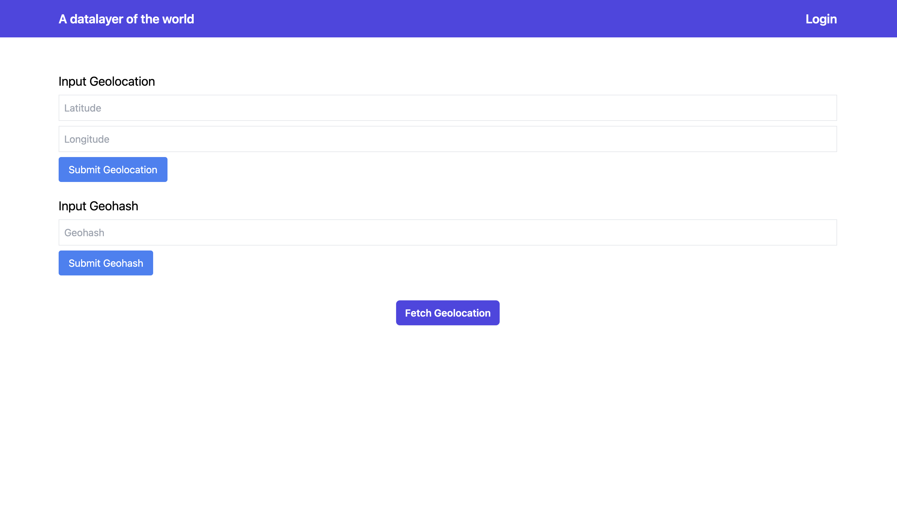

# A data layer for the world (v2) 
This is a basic version of a decentralized application built on the Internet Computer using Rust. It creates a geo-information platform that serves as a public good for everyone.

# Table of Contents
- [Introduction](#we-need-a-bitcoin-inspired-version-of-google-maps-as-a-public-good)
- [Use case](#this-application)
- [Technical overview](#Under-the-hood-it)
- [Architecture](#Architecture)
- [Demo of the app (video, screenshots)](#Demo-of-the-app)
- [Run it yourself](#How-to-run-this-application-locally)

## We need a Bitcoin-inspired version of Google Maps as a public good
Our understanding of the world’s surface increasingly comes from “second layers” like Google Maps. These layers are used by humans, cars, and other devices for decision making and navigation.

### Map apps lack data for important geo decisions
Current platforms inform decisions like “where to eat?” or “where to buy?” However, they lack the information needed to decide “where to move,” “where to avoid due to high crime rates,” or “which neighborhood most needs public health measures.” These decisions require data on pollution rates over time, flood or hurricane probabilities, and crime rates in specific areas. Furthermore, current second layers do not provide a way to communicate value directly tied to a location. This would enable compensating users for improving an area or directly donating to victims of a natural catastrophe in a specific region.

### We need a trusted public memory and value layer of world’s surface
Just as Bitcoin revolutionized currency by making it a decentralized public good, we need a decentralized and tamper-proof public memory and value layer for the world. It is governed by a foundation or DAO and runs on the Internet Computer.

## This application
... uses a set of canisters on the Internet Computer to create a grid of the world’s surface. Each square in the grid can hold information and value. Users authenticate with Internet Identity and interact with the squares via a React application. They read or contribute information or communicate value to other users. Other devices / systems interact with the squares via the API endpoint.

Users can send value to a square’s address or contribute by adding information, which can be compensated with some of the value held by the square. When an authenticated user first visits a square, its NFT is transferred to the user’s NFT wallet. Owning a square’s NFT does not provide control over the square; it is similar to owning digital art. NFT owners are patrons of the square. They are encouraged to improve its health metrics and gather donations. They earn part of the square’s income when its health and donation flow are good. 

The application controls the square. A decentralized governance system (e.g., a DAO, to be defined) controls the application. It sets and oversees rules for distributing value to users. The NFT transfer to users is not implemented in this MVP.

Let's imagine some use cases:

**User owns square nft:**
When you are the first user (authenticated with Internet Identity) to log in to a specific square, the NFT of this square becomes yours. While a square NFT does not give you control over its governance or funds, you will participate in a share of its donation income when the square’s health is good (e.g., good air quality index, low crime rate) and donations exceed a threshold. Holding a square NFT is not only an honor but also truly unique, as each square exists only once on the world’s surface. It also carries a mission to positively influence the square’s health and donation flow. If the square’s health and donation flow remain low for a certain period, ownership of the NFT is transferred back to the application for someone else to claim.

**Users contribute to squares:**
Users can contribute to a square by donating to its addresses or adding information about the square. For example, in an area that experiences a heavy rainy season each year, causing basements to flood, a user can log this information. If enough other users in the area corroborate this information, the contributing user is rewarded with a share of the square’s funds. Additionally, the users who corroborate the information also receive rewards.

**Users read square information:**
For anyone looking to move to an area or build a house, it’s important to know what happens during different seasons to evaluate risks and costs, such as flooding or hurricanes. For example, if basements in a particular area flood at least once a year after heavy rains, this is valuable information to have before moving there or storing items in a newly rented basement. Normally, you only get such information by speaking to the right people. If users log such information on a square, others can gain valuable insights to base their decisions on.

**Donating directly to square residents:**
When a natural disaster happens, residents in the affected area need funds immediately to rebuild. Donations can be made directly to the square’s addresses in this area, which can be immediately distributed to residents through an automated system in the data layer application (governed by a DAO, for example). Therefore, Internet Identity needs to include a form of “proof of humanhood,” and the resident group can be defined by considering all Internet Identities that logged in regularly to squares in this area over a period of time in the past.

## Under the hood it
... creates fixed squares where each square is represented by a [geohash](https://en.wikipedia.org/wiki/Geohash). Each square / geohash is a [Dip721 Nft](https://github.com/Psychedelic/DIP721/blob/develop/spec.md) holding information such as an IPNS name pointing to metadata on IPFS. It also holds crypto addresses for Bitcoin, Ether, or USDC. The NFT points to changing information on IPFS like air quality index, crime rate, or car accident rate. This information is regularly updated via APIs or user contributions. The application interacts with Bitcoin or EVM blockchains to show balances and transact Bitcoin, Ether, or USDC between users and squares. IPNS / IPFS integration is not implemented in this MVP.

## Architecture

You can find a schematic of the architecture in this [Google slide](https://docs.google.com/presentation/d/11YnsjIpe3zVtMEjBEjWnBFNIk1GdDwzVndu_FyET20o/edit?usp=sharing)

### geohash Canister

The Geohash Canister handles geolocation data, converting it into geohashes and decoding geohashes back into coordinates. It serves as the backend, managing calls to dip721_nft_container, basic_bitcoin, and basic_ethereum canisters for minting or looking up NFTs, and querying balance or metadata on IPFS. Some functionality (Ethereum balance, IPFS interaction) is not part of this MVP.

The canister provides three main functions:

- **compute_geohash**: Takes a geolocation (latitude, longitude) and returns the calculated geohash and the geographical bounds (square) it falls within. If no NFT exists, it mints a new one; otherwise, it retrieves existing NFT information.
    - **Input**: Geolocation (latitude: f64, longitude: f64)
    - **Output**: latitude and longitude boundaries, computed geohash, NFT information, Bitcoin and Ethereum balances, real-time metrics, and a flag indicating if the NFT was newly created or already existed.

- **compute_area**: Takes a geohash and decodes it back into coordinates, then calculates the geographical bounds (square) for these coordinates. If no NFT exists, it mints a new one; otherwise, it retrieves existing NFT information.
    - **Input**: Geohash (String)
    - **Output**: latitude and longitude boundaries, original geohash, NFT information, Bitcoin and Ethereum balances, real-time metrics, and a flag indicating if the NFT was newly created or already existed.

- **update_rating**: Allows users to update the rating of a square, serving as a simple MVP for user-contributed information.
    - **Input**: IPNS name (String), Rating (u32)
    - **Output**: Result indicating success or failure.
    - **What it does**: Updates the rating for the specified square, provided the rating is within the valid range (1 to 10). For now IPNS name is the key to store the rating on the canister. In the future the IPNS name should point to a content ID on IPFS instead.

### frontend canister

The frontend application is designed to interact with the Geohash Canister on the Internet Computer. It allows users to authenticate, submit geolocations or geohashes, and update ratings for specific squares. The main features include:

- **User Authentication**: Users authenticate with Internet Identity, enabling secure interaction with the application.

- **Geolocation Submission**: Users can input their geolocation (latitude and longitude) to get information about the corresponding square, including the geohash, geographical bounds, NFT information, and real-time metrics.

- **Geohash Submission**: Users can input a geohash for a geolocation. This location will be mapped to the square it belongs to, and the geohash of this square (of the geolocation of the center of the square) is returned, along with geographical bounds, NFT information, and real-time metrics.

- **Update Rating**: Authenticated users can update the rating of a specific square, contributing to the user-generated data for that area.

- **Data Display**: The application displays detailed information about the square, including NFT metadata, Bitcoin and Ethereum addresses and balances, and real-time metrics like air quality, crime rate, and car accident rate.

- **Fetch Geolocation**: Users can fetch their current geolocation using the browser's geolocation API to simplify the submission process.

### basic_bitcoin canister

The Basic Bitcoin Canister is designed to handle Bitcoin address generation and balance retrieval. This canister code was cloned from [basic_bitcoin example repo](https://github.com/dfinity/examples/tree/master/rust/basic_bitcoin). Changes made: It ensures that each square geohash generates a unique Bitcoin address, with the same geohash always producing the same address.

- **get_p2pkh_address**: This function takes a geohash as input and returns a Bitcoin address derived from it.
    - **Input**: Geohash (String)
    - **Output**: Bitcoin address (String)
    - **What it does**: The function converts the geohash into a derivation path and uses it to generate a Bitcoin address. The same geohash will always produce the same address.

- **get_balance**: This function takes a Bitcoin address as input and returns its balance.
    - **Input**: Bitcoin address (String)
    - **Output**: Balance (u64)
    - **What it does**: The function queries the Bitcoin network to retrieve the balance of the given address.

### basic_ethereum canister

The Basic Ethereum Canister was cloned from [basic_ethereum example repo](https://github.com/dfinity/examples/tree/master/rust/basic_ethereum) and modified to generate Ethereum addresses based on geohashes and the calling principal. This method is a simple solution for the MVP and may be changed later.

- **ethereum_address**: This function takes an optional owner principal and a geohash as input and returns an Ethereum address derived from them.
    - **Input**: Owner (Option<Principal>), Geohash (String)
    - **Output**: Ethereum address (String)
    - **What it does**: The function generates an Ethereum address using the provided geohash and the calling principal. This ensures that each square's geohash and the calling principal produce a unique Ethereum address. 

### dip721_nft_container

The DIP721 NFT Container mints NFTs geohashes, IPNS names, and crypto addresses in the metadata. It looks up NFTs with their metadata. This canister code was cloned from [this repo](https://github.com/dfinity/examples/tree/master/rust/dip721-nft-container). 

- **get_metadata**: This function retrieves the metadata of an NFT by its token ID.
    - **Input**: Token ID (u64)
    - **Output**: MetadataDesc
    - **What it does**: The function retrieves and returns the metadata associated with the given token ID. If the token ID is invalid, an error is returned.

- **mint**: This function mints a new NFT, assigning it to a specified principal and storing its metadata and content.
    - **Input**: Principal (to), MetadataDesc (metadata), Blob content (Vec<u8>)
    - **Output**: MintResult containing the transaction ID and token ID
    - **What it does**: The function creates a new NFT with the provided metadata and content, assigns it to the specified principal, and stores it in the canister's state. The transaction ID and token ID of the newly minted NFT are returned.

### nft-wallet

Not in scope for this MVP. This code was cloned but not yet integrated into the current application. To be done in future iterations. This canister code was cloned from [this repo](https://github.com/dfinity/examples/tree/master/rust/nft-wallet). 

## Demo of the app
### Video

https://www.loom.com/share/a2f56f02e9bc4b2091c5212f1fe0aaf9?sid=0a4f5d29-82bd-4198-b740-4bea5947af55

### Screenshots

#### Load react app

## How to run this application locally

- Clone the repo
- Start local dfx replica in terminal with `dfx start`
- Build canisters in another terminal with `dfx build`
- Deploy geohash canister to get canister-id with `dfx deploy geohash`
- Deploy dip721_nft_container with `dfx deploy dip721_nft_container` and specify geohash canister-id as principal
- Deploy canisters `basic_ethereum`, `basic_bitcoin`, `internet_identity`
- Insert canister-ids of dip721_nft_container, basic_ethereum and basic_bitcoin in `geohash/src/lib.rs` init function and `dfx build geohash`, then `dfx deploy --mode=reinstall geohash`
- In root run `node setupEnv.js` to create ENV file in frontend folder and fill in Canister ids (internet_identity, geohash) from `.dfx/local/canister_ids.json`
- In `/frontend` run `npm install` and then `npm run build`
- In root run `dfx deploy frontend`
- Open frontend or canister candid UI using  `http://127.0.0.1:8001` (defined in dfx.json)

